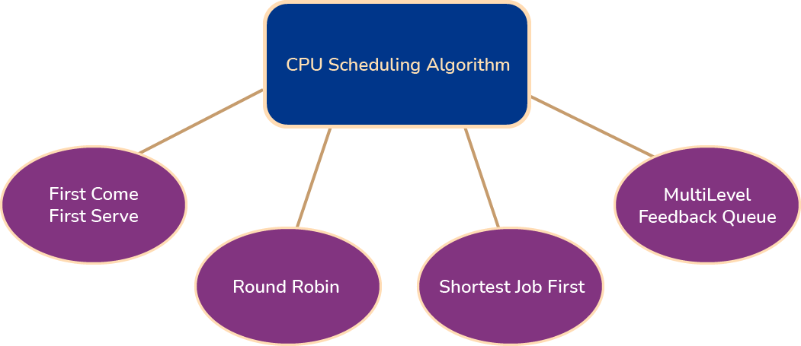
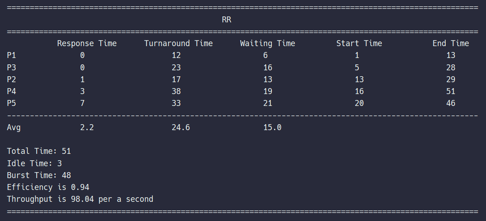

# CPU Scheduling Algorithm (os simulator)
<p align='center'>
    
</p>

This is an OS simulation that has been implemented by the CPU scheduling algorithms such as:<br>
- First Come, First Serve (<a href="https://en.wikipedia.org/wiki/Scheduling_(computing)#First_come,_first_served">FCFS</a>)
- Round Robin (<a href="https://en.wikipedia.org/wiki/Round-robin_scheduling">RR</a>)
- Shortest Job First (<a href="https://en.wikipedia.org/wiki/Shortest_job_next">SJF</a>)
- MultiLevel Feedback Queue (<a href="https://www.geeksforgeeks.org/multilevel-feedback-queue-scheduling-mlfq-cpu-scheduling/">MLFQ</a>) :
  - First queue: RR Time Quantum 8 ms
  - Second queue: RR with time Quantum 16 ms
  - Third queue: FCFS
<br>
<br>
<p align='center'>
    
</p>

<br>

## Program Input
Input data must be entered through a comma-separated values (.csv) and the columns must be like this:

| process_id | arrival_time | cpu_time1 | io_time | cpu_time2 |
| :---: | :---: | :---: | :---: | :---: |
| 1 | 1 | 2 | 3 | 4 |
| 2 | 12 | 3 | 4 | 1 |
| 3 | 5 | 4 | 5 | 3 |
| 4 | 13 | 4 | 5 | 15 |
| 5 | 13 | 5 | 6 | 7 |

you can see and download test file **<a href="test/process_input_data.csv">here</a>**

## Program Output
1. the program will process the processes and will calculate these information:
    - Response Time
    - Turnaround Time
    - Waiting Time
    - Process' Start Time
    - Process' End Time
2. after running the algorithms for each processes these parameteres will be shown for the algorithm:   
    - Total Time and Idle Time
    - Average Waiting Time
    - Average Response Time
    - Average Turnaround Time
    - CPU Utilization
    - Throughput

<p align='right'>
    
</p>


## Installation

_Below is an example of how you can clone and run project on your local._

1. Clone the repo
   ```sh
   git clone https://github.com/Amir-Shamsi/cpu-scheduling-algorithm.git
   ```
2. Install requirement libraries
   ```sh
   pip install -r requirement-libs.txt
   ```
3. Make a coffie and enjoy! ☕

<p align="right">
    (<a href="#top">back to top</a>)
</p>


